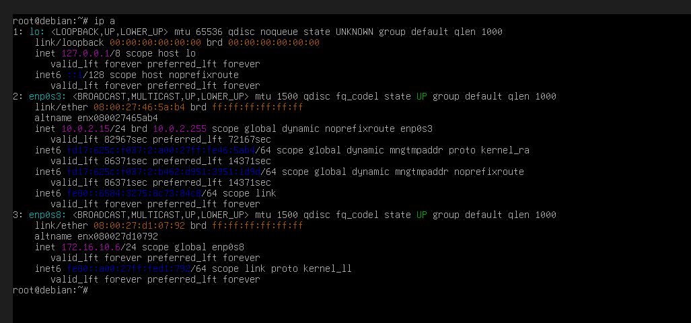
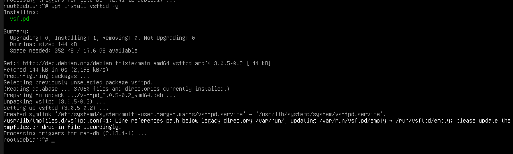

# 🛡️ Projet 1 : Analyse et Cartographie Réseau - Sprint 1
## 🎯 Cible : SRVLX01 (Debian Server)

### 📋 Présentation de la mission
Dans le cadre du premier sprint de notre projet d'audit réseau, mon rôle consistait à préparer la machine cible **Debian 13 (SRVLX01)**. L'objectif est d'isoler cette machine sur notre réseau de laboratoire et d'y injecter délibérément des vulnérabilités (services non sécurisés) afin de pouvoir les cartographier par la suite.

---

## 🏗️ 1. Configuration de l'Infrastructure et du Réseau
Pour isoler nos tests et permettre l'écoute des paquets réseau, la machine virtuelle a été configurée sur un commutateur interne spécifique.

* **Réseau Interne :** `intnet`
* **Mode Promiscuité :** `Autoriser tout` (Indispensable pour l'analyse de trames).

> **Preuve matérielle (VirtualBox) :**
> 

---

## ⚙️ 2. Personnalisation de l'Identité et Adressage IP
Afin de garantir la stabilité des scans Nmap, la cible doit posséder une adresse IP statique. J'ai édité manuellement la configuration réseau du système d'exploitation. L'accès administrateur a également été verrouillé avec le mot de passe du projet (`Azerty1*`).

**Commande exécutée :** `sudo nano /etc/network/interfaces`

> **Édition du fichier de configuration réseau :**
> 

Après un redémarrage du service réseau, l'interface `enp0s8` a correctement récupéré l'adresse `172.16.10.6`.

> **Vérification de l'interface active :**
> 

---

## 🔓 3. Implémentation des Failles de Sécurité
Pour simuler une cible réaliste, j'ai déployé deux services critiques souvent visés par les audits de sécurité. 

### A. Serveur Web (Port 80 HTTP)
Installation d'un serveur Web Apache2 tournant en clair, sans certificat de sécurité.
**Commande exécutée :** `apt install apache2 -y`

> **Validation du déploiement Apache :**
> 

### B. Service de transfert de fichiers (Port 21 FTP)
Installation du service `vsftpd`. Le protocole FTP est une vulnérabilité majeure car il transmet les données et les identifiants en clair.
**Commande exécutée :** `apt install vsftpd -y`

> **Validation du déploiement FTP :**
> 

### C. Vérification locale des services
Pour s'assurer que les services tournent correctement, le pare-feu système a été désactivé (`ufw disable`) et les sockets en écoute ont été listés.

**Commande exécutée :** `ss -tunlp`

> **Ports 21 et 80 en écoute (État LISTEN) :**
> 

---

## 🔍 4. Validation de la Cible (Preuve d'Audit)
L'ultime étape du Sprint 1 consiste à prouver que les vulnérabilités créées sont bien exploitables depuis l'extérieur. Un scan réseau a été lancé depuis notre machine d'attaque (**UBU01** - IP : 172.16.10.20).

**Commande d'audit :** `nmap 172.16.10.6`

> **Résultat de l'analyse réseau :**
> 

**✅ Conclusion :** Nmap confirme de manière formelle que les ports **21/tcp (ftp)** et **80/tcp (http)** sont **OUVERTS**. Le serveur SRVLX01 est parfaitement configuré et vulnérabilisé pour la suite du projet.
